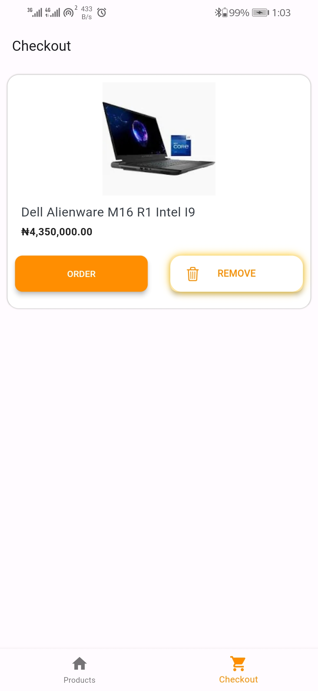

# simple_shopping_app

SimpleShoppingApp is an simple App that just displays a few products(items) and allows you to add or
remove
any of the products to the checkout(cart).

## Features

- Feature 1: You can add items to the checkout(cart) by pressing the add to cart button
- Feature 2: Pressing any of the icons on the bottom navigator bar would take you the Checkout or
  Product screen respectively
- Feature 3: You can remove items from the checkout screen by pressing the remove button
- Feature 4: Pressing the Order button on any of the items added would take you to an order
  successful screen
- Feature 5: Pressing the Back arrow button on the taskbar in the order screen would take you back
  to the product screen

## Installation

Follow these steps to install and run SimpleShoppingApp on your system.

### Prerequisites

There are no external dependencies required.

### Clone the Repository

1. Open your terminal or command prompt.

2. Use the following command to clone the ProjectName repository:

git clone https://github.com/SSID98/simple_shopping_app_hng.git

### Configuration

1. Change your working directory to the cloned repository:

cd SimpleShoppingApp

### Build and Run

1. Connect your device or start an emulator.

2. To build and run the project, use the following command:

[build/run command]

This will build the project and install it on your connected device or emulator.

## Usage

1. Using the Project is Pretty simple, Firstly ensure you have your internet on else the product
   pictures won't show
2. The rest is just as described in the features, add a product to the checkout screen, use the
   icons in the bottom to navigate between the screens, remove an item from the check out screen
   using the remove button on any of the items and finally order the item using the order button

## Screenshots

1. Product Page: 

2. Checkout
   page: 

3. Order Success
   Page: 